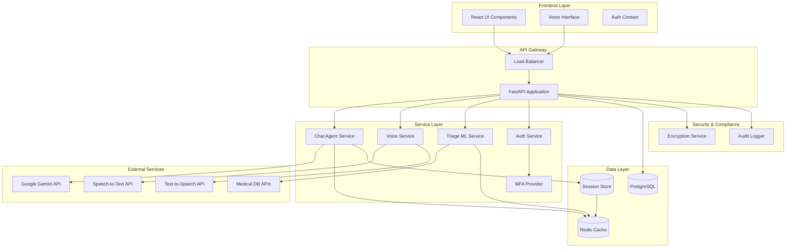

# Design Document: Comprehensive Chatbot Enhancements

## Overview

This design document specifies the technical architecture for comprehensive enhancements to the AI Healthcare Chatbot system. The enhancements address six core areas: conversation quality through multi-turn context management, voice interaction capabilities with multi-language support, triage accuracy improvements, UI/UX accessibility compliance, HIPAA security measures, and performance optimization through caching and load balancing.

### System Context

The existing system consists of:
- **Backend**: FastAPI application with Google Gemini AI integration, PostgreSQL database, and ML-based triage using TF-IDF + Logistic Regression
- **Frontend**: React TypeScript application with Vite, TailwindCSS, and React Router
- **Current Capabilities**: Basic chat interaction, gTTS voice synthesis, symptom triage, JWT authentication

### Enhancement Scope

The enhancements will transform the system into a production-grade healthcare platform with:
- **Conversation Intelligence**: Context-aware multi-turn dialogues with automatic summarization
- **Advanced Voice**: Real-time multi-language recognition with natural speech synthesis
- **Clinical Decision Support**: Enhanced triage with medical database integration and emergency detection
- **Accessibility**: WCAG 2.1 AA compliance with responsive design and dark mode
- **Enterprise Security**: HIPAA-compliant encryption, MFA, and comprehensive audit logging
- **High Performance**: Sub-2-second response times with intelligent caching and horizontal scalability

## Architecture

### High-Level Architecture



### Architecture Patterns

**Pattern 1: Cache-Aside Pattern**
- Application checks cache before querying database or external APIs
- On cache miss, fetch from source and populate cache
- Used for: Medical knowledge base entries, triage patterns, user sessions

**Pattern 2: Repository Pattern**
- Abstraction layer between business logic and data access
- Separate repositories for User, Conversation, AuditLog entities
- Enables testability and database independence

**Pattern 3: Strategy Pattern**
- Pluggable algorithms for triage, language detection, response generation
- Enables switching between different ML models or AI providers
- Facilitates A/B testing and gradual rollouts

**Pattern 4: Observer Pattern**
- Event-driven architecture for emergency detection
- Audit logging triggers on data access events
- Real-time notifications for critical situations

**Pattern 5: Circuit Breaker Pattern**
- Prevents cascading failures when external services are unavailable
- Fallback strategies for Gemini API, medical databases, voice services
- Automatic recovery detection and retry logic

## Components and Interfaces

### 1. Context Manager Component

**Purpose**: Manage conversation history with automatic summarization

**Interface**:
```python
class ContextManager:
    async def get_context(self, session_id: str, max_turns: int = 20) -> ConversationContext
    async def add_turn(self, session_id: str, role: str, content: str) -> None
    async def summarize_old_turns(self, session_id: str, threshold: int = 50) -> str
    async def extract_medical_facts(self, context: ConversationContext) -> List[MedicalFact]
```

**Key Responsibilities**:
- Retrieve last N conversation turns from session store
- Identify medical information requiring preservation (symptoms, medications, allergies)
- Trigger summarization when conversation exceeds 50 turns
- Maintain conversation coherence across sessions

**Implementation Strategy**:
- Store conversation turns in Redis with session-based keys
- Use Gemini API for intelligent summarization preserving medical context
- Implement sliding window approach: keep recent 20 turns + summarized history
- Cache frequently accessed contexts in memory (LRU eviction)

### 2. Enhanced Chat Agent Component

**Purpose**: Generate contextually aware, personalized medical responses

**Interface**:
```python
class EnhancedChatAgent:
    async def generate_response(
        self,
        message: str,
        context: ConversationContext,
        user_profile: UserProfile,
        language: str
    ) -> ChatResponse
    
    async def check_contraindications(
        self,
        medications: List[str],
        allergies: List[str]
    ) -> List[Warning]
    
    async def query_knowledge_base(
        self,
        symptoms: List[str]
    ) -> List[MedicalCondition]
```

**Key Responsibilities**:
- Integrate conversation history into prompt construction
- Personalize responses based on age, gender, medical history
- Query medical knowledge base for accurate information
- Cite information sources in responses
- Detect and handle language mixing issues

**Implementation Strategy**:
- Extend existing `ChatAgent` class with context and profile parameters
- Build comprehensive system prompts incorporating user demographics
- Implement knowledge base as structured PostgreSQL tables with full-text search
- Add citation tracking in response metadata
- Maintain fallback responses for API failures

### 3. Knowledge Base Component

**Purpose**: Store and retrieve medical information

**Database Schema**:
```sql
CREATE TABLE medical_conditions (
    id UUID PRIMARY KEY,
    name VARCHAR(255) NOT NULL,
    icd10_code VARCHAR(10),
    symptoms TEXT[],
    causes TEXT,
    treatments TEXT,
    severity VARCHAR(50),
    sources TEXT[],
    last_updated TIMESTAMP,
    review_required BOOLEAN DEFAULT FALSE
);

CREATE TABLE medications (
    id UUID PRIMARY KEY,
    name VARCHAR(255) NOT NULL,
    contraindications TEXT[],
    side_effects TEXT[],
    interactions UUID[] REFERENCES medications(id)
);

CREATE INDEX idx_conditions_symptoms ON medical_conditions USING GIN(symptoms);
CREATE INDEX idx_conditions_updated ON medical_conditions(last_updated);
```

**Interface**:
```python
class KnowledgeBase:
    async def search_conditions(self, symptoms: List[str], limit: int = 10) -> List[MedicalCondition]
    async def get_condition_details(self, condition_id: UUID) -> MedicalCondition
    async def check_medication_safety(self, med_id: UUID, allergies: List[str]) -> SafetyCheck
    async def flag_outdated_entries(self, age_threshold_months: int = 12) -> int
```

**Key Responsibilities**:
- Store 500+ medical conditions with comprehensive information
- Full-text search across symptoms and condition descriptions
- Track information freshness and flag outdated entries
- Provide citation sources for all medical information

### 4. Voice Service Component

**Purpose**: Multi-language speech recognition and natural synthesis

**Interface**:
```python
class VoiceService:
    async def transcribe_audio(
        self,
        audio_data: bytes,
        language_hint: Optional[str] = None
    ) -> TranscriptionResult
    
    async def detect_language(self, audio_data: bytes) -> LanguageDetection
    
    async def synthesize_speech(
        self,
        text: str,
        language: str,
        voice_gender: str = "female",
        speed: float = 1.0
    ) -> AudioResult
    
    async def apply_noise_filtering(self, audio_data: bytes) -> bytes
    
    async def stream_transcription(
        self,
        audio_stream: AsyncIterator[bytes]
    ) -> AsyncIterator[PartialTranscription]
```

**Technology Selection**:
- **Speech-to-Text**: Google Cloud Speech-to-Text API (supports Hindi, Marathi, Gujarati, English)
- **Text-to-Speech**: Google Cloud Text-to-Speech API with WaveNet voices for natural prosody
- **Language Detection**: Google Cloud Speech language detection with confidence scores
- **Noise Filtering**: WebRTC Audio Processing library (noisereduce Python package)

**Key Responsibilities**:
- Transcribe speech in 4 languages with 90%+ accuracy
- Detect language within 500ms
- Generate natural-sounding speech with medical term pronunciation
- Stream partial transcriptions every 500ms
- Filter background noise above 40dB

**Implementation Strategy**:
- Replace gTTS with Google Cloud TTS for higher quality
- Implement streaming transcription with WebSocket connections
- Cache common medical term pronunciations
- Use adaptive noise filtering based on detected noise levels

### 5. Advanced Triage System Component

**Purpose**: Accurate symptom analysis with emergency detection

**Interface**:
```python
class AdvancedTriageSystem:
    async def analyze_symptoms(
        self,
        symptoms: List[str],
        user_profile: UserProfile
    ) -> TriageResult
    
    async def detect_emergency(self, symptoms: List[str], message: str) -> EmergencyStatus
    
    async def rank_departments(self, symptoms: List[str]) -> List[DepartmentRecommendation]
    
    async def identify_comorbidities(self, symptoms: List[str]) -> List[ComorbidityPattern]
    
    async def generate_followup(
        self,
        triage_result: TriageResult
    ) -> FollowUpRecommendation
```

**ML Model Architecture**:
```
Input: TF-IDF vectors (1-2 grams) from symptom text
↓
Feature Engineering: 200+ symptom patterns
↓
Model: Ensemble of:
  - Logistic Regression (current baseline)
  - Random Forest Classifier (for non-linear patterns)
  - XGBoost (for boosted accuracy)
↓
Output: Department probabilities + confidence scores
```

**Target Performance**:
- 85%+ accuracy on validation set
- <3 second prediction latency including external DB queries
- Confidence calibration (predicted probabilities match actual accuracy)

**Key Responsibilities**:
- Analyze symptoms against 200+ patterns
- Achieve 85%+ department classification accuracy
- Integrate with ICD-10 and SNOMED CT databases
- Detect emergency keywords within 1 second
- Generate evidence-based follow-up recommendations

**Implementation Strategy**:
- Extend existing TF-IDF + LogisticRegression pipeline to ensemble model
- Add medical database integration with 3-second timeout and local fallback
- Implement emergency keyword dictionary with severity scores
- Cache medical codes for 24 hours with Redis
- Train model on expanded dataset with demographic features

### 6. Emergency Detection Component

**Purpose**: Identify and escalate urgent medical situations

**Emergency Keywords Dictionary**:
```python
EMERGENCY_KEYWORDS = {
    "critical": ["chest pain", "difficulty breathing", "severe bleeding", "unconscious",
                 "stroke symptoms", "heart attack", "severe burns", "poisoning"],
    "high": ["broken bone", "high fever", "severe pain", "head injury", "pregnancy complications"],
    "moderate": ["persistent vomiting", "dehydration", "allergic reaction", "infection signs"]
}
```

**Interface**:
```python
class EmergencyDetector:
    async def detect(self, message: str, symptoms: List[str]) -> EmergencyStatus
    async def log_detection(self, session_id: str, emergency: EmergencyStatus) -> None
    async def get_emergency_contacts(self, region: str) -> EmergencyContacts
```

**Key Responsibilities**:
- Scan messages for emergency keywords with <1 second latency
- Classify emergency severity (critical, high, moderate)
- Log all detections to audit system
- Provide region-specific emergency hotline numbers
- Trigger UI color scheme change to red warning state

### 7. UI Component Enhancements

**Purpose**: Accessible, responsive interface with dark mode

**Component Structure**:
```typescript
interface UIEnhancements {
  // Responsive Design
  ResponsiveLayout: React.FC<{ children: ReactNode }>
  AdaptiveViewport: React.FC<{ onOrientationChange: (orientation: string) => void }>
  
  // Accessibility
  AccessibleChatMessage: React.FC<{ message: Message; ariaLabel: string }>
  KeyboardNavigable: React.FC<{ elements: NavigableElement[] }>
  ScreenReaderAnnouncer: React.FC<{ announcement: string; priority: 'polite' | 'assertive' }>
  
  // Theme System
  ThemeProvider: React.FC<{ theme: 'light' | 'dark' | 'auto' }>
  ColorSchemeToggle: React.FC<{ onChange: (scheme: string) => void }>
  
  // Interactive Features
  BodyDiagram: React.FC<{ onRegionSelect: (region: BodyRegion) => void }>
  SymptomIntensitySlider: React.FC<{ min: 1; max: 10; onChange: (value: number) => void }>
  
  // Voice Features
  VoiceInputIndicator: React.FC<{ isListening: boolean; confidence: number }>
  RealtimeTranscriptionPreview: React.FC<{ text: string; isFinal: boolean }>
}
```

**WCAG 2.1 AA Compliance Strategy**:
- **Perceivable**: 4.5:1 contrast ratios, text alternatives, captions for audio
- **Operable**: Full keyboard navigation, 44x44px touch targets, no flashing content
- **Understandable**: Clear language, consistent navigation, input assistance
- **Robust**: Valid HTML, ARIA labels, screen reader compatibility

**Responsive Breakpoints**:
- Mobile: 320px - 767px (single column, stacked layout)
- Tablet: 768px - 1023px (two column, side-by-side on landscape)
- Desktop: 1024px - 3840px (three column, sidebar + main + details)

**Implementation Strategy**:
- Use TailwindCSS responsive utilities for breakpoint management
- Implement CSS Grid for flexible layouts
- Add ARIA landmarks and labels to all interactive elements
- Use `prefers-color-scheme` media query for auto theme detection
- Implement focus trap in modal dialogs
- Test with NVDA, JAWS, and VoiceOver screen readers

### 8. Multi-Factor Authentication Component

**Purpose**: Secure account access with second factor

**Interface**:
```python
class MFAProvider:
    async def setup_totp(self, user_id: UUID) -> TOTPSetup
    async def verify_totp(self, user_id: UUID, code: str) -> bool
    async def send_sms_code(self, phone_number: str) -> str
    async def verify_sms_code(self, session_id: str, code: str) -> bool
    async def generate_backup_codes(self, user_id: UUID, count: int = 10) -> List[str]
    async def check_lockout(self, user_id: UUID) -> LockoutStatus
```

**Technology Selection**:
- **TOTP**: pyotp library for Time-based One-Time Passwords (RFC 6238)
- **SMS**: Twilio API for SMS delivery
- **QR Codes**: qrcode library for TOTP secret display

**Key Responsibilities**:
- Generate TOTP secrets and QR codes for authenticator apps
- Verify TOTP codes with 30-second time window and 1-step clock skew
- Send SMS verification codes via Twilio
- Implement 3-strike lockout with 15-minute timeout
- Generate and securely store backup recovery codes

**Implementation Strategy**:
- Hash TOTP secrets before database storage (AES-256)
- Implement rate limiting on verification attempts (3 per 5 minutes)
- Store backup codes as bcrypt hashes
- Add MFA middleware to protected routes
- Provide SMS fallback when TOTP unavailable

### 9. Encryption Service Component

**Purpose**: Encrypt PHI at rest and in transit

**Interface**:
```python
class EncryptionService:
    async def encrypt_at_rest(self, data: bytes, sensitivity: DataSensitivity) -> EncryptedData
    async def decrypt_at_rest(self, encrypted: EncryptedData) -> bytes
    async def rotate_keys(self) -> KeyRotationResult
    async def verify_tls_version(self, connection: Connection) -> bool
```

**Encryption Strategy**:
- **At Rest**: AES-256-GCM with unique nonce per encryption
- **In Transit**: TLS 1.3 with modern cipher suites
- **Key Management**: 
  - Master key in AWS KMS or HashiCorp Vault
  - Data encryption keys (DEKs) per sensitivity level
  - 90-day automatic key rotation

**Key Responsibilities**:
- Encrypt all PHI fields in database (symptoms, medical history, medications)
- Enforce TLS 1.3 for all API connections
- Rotate encryption keys every 90 days
- Use separate keys for different sensitivity levels
- Maintain key versioning for decryption of historical data

**Implementation Strategy**:
- Use Python cryptography library for AES-GCM
- Implement envelope encryption (DEKs encrypted by master key)
- Store encrypted DEKs in database metadata
- Add pre-save hooks to encrypt sensitive fields
- Configure FastAPI to require TLS 1.3 minimum

### 10. Audit Logger Component

**Purpose**: Comprehensive HIPAA-compliant audit trail

**Interface**:
```python
class AuditLogger:
    async def log_auth_event(self, user_id: UUID, event_type: AuthEventType, ip: str) -> None
    async def log_data_access(self, user_id: UUID, resource: str, action: str) -> None
    async def log_config_change(self, user_id: UUID, setting: str, before: Any, after: Any) -> None
    async def log_api_request(self, request: Request) -> None
    async def export_logs(self, start_date: datetime, end_date: datetime, format: str) -> bytes
```

**Audit Log Schema**:
```sql
CREATE TABLE audit_logs (
    id UUID PRIMARY KEY,
    timestamp TIMESTAMPTZ NOT NULL DEFAULT NOW(),
    user_id UUID REFERENCES users(id),
    event_type VARCHAR(50) NOT NULL,
    resource VARCHAR(255),
    action VARCHAR(50),
    ip_address INET,
    user_agent TEXT,
    request_params JSONB,
    before_value JSONB,
    after_value JSONB,
    hash VARCHAR(64) NOT NULL,
    CONSTRAINT no_modification CHECK (false) DEFERRABLE INITIALLY DEFERRED
);

CREATE INDEX idx_audit_timestamp ON audit_logs(timestamp);
CREATE INDEX idx_audit_user ON audit_logs(user_id);
CREATE INDEX idx_audit_event ON audit_logs(event_type);
```

**Key Responsibilities**:
- Log all PHI access with timestamp, user, action
- Log authentication events (login, logout, failed attempts)
- Log configuration changes with before/after values
- Compute SHA-256 hash for tamper detection
- Retain logs for 6+ years (HIPAA requirement)
- Export logs in JSON, CSV formats

**Implementation Strategy**:
- Use write-once table constraint to prevent modification
- Compute hash over (timestamp + user_id + action + resource)
- Store logs in append-only PostgreSQL table
- Implement async logging to avoid blocking requests
- Add FastAPI middleware for automatic request logging
- Schedule daily log archival to S3 or similar

### 11. Cache Manager Component

**Purpose**: Intelligent caching for performance optimization

**Interface**:
```python
class CacheManager:
    async def get(self, key: str) -> Optional[Any]
    async def set(self, key: str, value: Any, ttl: int) -> None
    async def invalidate(self, pattern: str) -> int
    async def get_stats(self) -> CacheStats
```

**Caching Strategy**:
```python
CACHE_POLICIES = {
    "medical_knowledge": {
        "ttl": 21600,  # 6 hours
        "pattern": "knowledge:condition:*"
    },
    "triage_patterns": {
        "ttl": 14400,  # 4 hours
        "pattern": "triage:pattern:*"
    },
    "user_sessions": {
        "ttl": 900,  # 15 minutes
        "pattern": "session:*"
    },
    "medical_codes": {
        "ttl": 86400,  # 24 hours
        "pattern": "code:*"
    }
}
```

**Technology**: Redis with the following configuration:
- **Eviction Policy**: `allkeys-lru` (evict least recently used keys when memory full)
- **Max Memory**: 2GB initially, scale based on usage
- **Persistence**: RDB snapshots every 15 minutes for recovery

**Key Responsibilities**:
- Cache medical knowledge queries for 6 hours
- Cache user session data with 15-minute TTL
- Cache medical database codes for 24 hours
- Achieve 70%+ cache hit rate
- Evict LRU entries when memory exceeds 80%
- Invalidate cache on underlying data updates

**Implementation Strategy**:
- Use `redis-py` async client
- Implement cache-aside pattern in service layer
- Add cache statistics endpoint for monitoring
- Use Redis key expiration for automatic TTL
- Implement cache warming for common queries on startup

### 12. Database Query Optimizer Component

**Purpose**: Optimize PostgreSQL query performance

**Optimization Strategies**:

**1. Indexing Strategy**:
```sql
-- Frequently queried columns
CREATE INDEX idx_users_email ON users(email);
CREATE INDEX idx_conversations_session ON conversations(session_id);
CREATE INDEX idx_messages_timestamp ON messages(timestamp DESC);
CREATE INDEX idx_conditions_symptoms ON medical_conditions USING GIN(symptoms);

-- Composite indexes for common joins
CREATE INDEX idx_messages_session_time ON messages(session_id, timestamp DESC);
```

**2. Connection Pooling**:
```python
# SQLAlchemy pool configuration
engine = create_engine(
    database_url,
    pool_size=10,  # Minimum connections
    max_overflow=40,  # Additional connections under load
    pool_pre_ping=True,  # Verify connection health
    pool_recycle=3600  # Recycle connections every hour
)
```

**3. Query Optimization**:
- Use prepared statements for parameterized queries
- Implement pagination with `LIMIT` and `OFFSET` for large result sets
- Use `EXPLAIN ANALYZE` to identify slow queries
- Implement result caching for complex aggregations
- Use database views for frequently joined tables

**4. PgBouncer Integration** (Future Enhancement):
- Transaction-mode pooling for higher concurrency
- Reduces connection overhead from 5-10ms to <1ms
- Supports 1000+ client connections with 50 database connections

**Target Performance**:
- Simple queries: <10ms
- Complex joins: <100ms for tables under 1M rows
- Full-text search: <200ms with GIN indexes

### 13. Load Balancer Component

**Purpose**: Distribute traffic across backend instances

**Architecture**:
```
                    [Load Balancer]
                    /      |      \
             [Backend 1] [Backend 2] [Backend 3]
                    \      |      /
                  [PostgreSQL + Redis]
```

**Technology**: Nginx or AWS Application Load Balancer

**Configuration**:
```nginx
upstream backend {
    least_conn;  # Route to server with fewest connections
    server backend1:8000 weight=1 max_fails=3 fail_timeout=30s;
    server backend2:8000 weight=1 max_fails=3 fail_timeout=30s;
    server backend3:8000 weight=1 max_fails=3 fail_timeout=30s;
}

server {
    listen 443 ssl http2;
    ssl_protocols TLSv1.3;
    
    location / {
        proxy_pass http://backend;
        proxy_set_header X-Forwarded-For $proxy_add_x_forwarded_for;
        
        # Sticky sessions for WebSocket
        ip_hash;
    }
    
    location /health {
        proxy_pass http://backend/api/health;
        proxy_connect_timeout 2s;
    }
}
```

**Health Check Strategy**:
- HTTP GET to `/api/health` every 10 seconds
- Remove instance after 3 consecutive failures
- Re-add instance after successful health check
- Monitor database and Redis connectivity in health endpoint

**Scaling Strategy**:
- Horizontal scaling: Add instances when average CPU > 70%
- Target: 10 backend instances maximum
- Auto-scaling based on request queue depth
- Use containerization (Docker) for easy deployment

**Key Responsibilities**:
- Distribute requests using least-connections algorithm
- Maintain sticky sessions for WebSocket connections
- Remove unhealthy instances within 10 seconds
- Support horizontal scaling to 10+ instances
- Maintain 99.9% uptime SLA

## Data Models

### Conversation Context Model
```python
@dataclass
class ConversationContext:
    session_id: str
    user_id: UUID
    turns: List[ConversationTurn]
    summary: Optional[str]
    medical_facts: List[MedicalFact]
    created_at: datetime
    last_updated: datetime

@dataclass
class ConversationTurn:
    role: str  # 'user' or 'assistant'
    content: str
    timestamp: datetime
    metadata: Dict[str, Any]

@dataclass
class MedicalFact:
    fact_type: str  # 'symptom', 'medication', 'allergy', 'condition'
    value: str
    mentioned_at: datetime
    confidence: float
```

### User Profile Model
```python
@dataclass
class UserProfile:
    user_id: UUID
    name: str
    age: Optional[int]
    gender: Optional[str]
    medical_history: List[str]
    allergies: List[str]
    current_medications: List[str]
    chronic_conditions: List[str]
    preferred_language: str
```

### Triage Result Model
```python
@dataclass
class TriageResult:
    session_id: str
    symptoms: List[str]
    department_rankings: List[DepartmentRecommendation]
    emergency_status: EmergencyStatus
    comorbidities: List[str]
    followup: FollowUpRecommendation
    confidence: float
    timestamp: datetime

@dataclass
class DepartmentRecommendation:
    department: str
    confidence: float
    reasoning: str
    relevant_symptoms: List[str]

@dataclass
class FollowUpRecommendation:
    urgency: str  # 'immediate', '24_hours', '1_week', 'routine'
    actions: List[str]
    warning_signs: List[str]
    self_care_measures: Optional[List[str]]
```

### Voice Interaction Models
```python
@dataclass
class TranscriptionResult:
    text: str
    language: str
    confidence: float
    alternatives: List[TranscriptionAlternative]
    duration_seconds: float

@dataclass
class AudioResult:
    audio_data: bytes
    format: str  # 'mp3', 'wav'
    duration_seconds: float
    sample_rate: int
```

### Security Models
```python
@dataclass
class AuditLogEntry:
    id: UUID
    timestamp: datetime
    user_id: UUID
    event_type: str
    resource: str
    action: str
    ip_address: str
    user_agent: str
    request_params: Dict[str, Any]
    hash: str

@dataclass
class EncryptedData:
    ciphertext: bytes
    key_version: int
    nonce: bytes
    algorithm: str  # 'AES-256-GCM'
```

## Correctness Properties

*A property is a characteristic or behavior that should hold true across all valid executions of a system—essentially, a formal statement about what the system should do. Properties serve as the bridge between human-readable specifications and machine-verifiable correctness guarantees.*


### Property Reflection

After analyzing all acceptance criteria, I identified the following testable properties suitable for property-based testing. Many criteria involve external services (AI, TTS/STT, medical databases), UI behavior, or infrastructure configuration which are better tested through integration tests, E2E tests, or smoke tests.

**Round-Trip Properties** (Classic PBT candidates):
- 1.5: Conversation context serialization round-trip
- 17.5: Encryption/decryption round-trip
- 23.4: Config parsing/pretty-printing round-trip
- 24.4: Session serialization round-trip

**Invariant Properties**:
- 7.5: Triage confidence scores sum to 1.0
- 21.6: Query results independent of parameter order
- 22.7: Load distribution fairness

**Behavioral Properties**:
- 1.1: Context retrieval returns correct number of turns
- 2.3: Outdated medical information flagging
- 3.2: Contraindication checking against allergies
- 6.4: Low-confidence transcription prompts
- 7.3: Department ranking by confidence
- 9.1: Emergency keyword detection
- 9.4: Emergency audit logging
- 15.5: MFA lockout after 3 failures
- 16.1, 16.5, 18.1-18.5: Comprehensive audit logging
- 20.4, 20.5: Cache invalidation and idempotence
- 21.5: Query pagination

**Validation Properties**:
- 3.5: Missing demographic clarification requests
- 16.6: Password complexity validation
- 17.4: Encryption verification before write
- 23.2, 23.5: Config validation and error reporting

**Redundancy Elimination**:
- Properties 18.1, 18.2, 18.3, 18.4 all test audit logging for different event types. These can be combined into a single comprehensive property: "For any system event, audit logging creates entries with required fields"
- Property 16.1 and 16.5 both test audit log creation for PHI access. These overlap and can be combined.

**Final Property Count**: ~20-25 properties suitable for PBT (focusing on pure business logic, not external services or UI)

### Property 1: Conversation Context Storage Round-Trip

*For any* valid conversation context with history, session data, and medical facts, serializing to session store then retrieving SHALL produce an equivalent conversation context with all turns, timestamps, and medical information preserved.

**Validates: Requirement 1.5**

### Property 2: Context Retrieval Respects Turn Limit

*For any* session with N conversation turns where N >= 0, retrieving context with a limit of 20 turns SHALL return exactly min(N, 20) turns in chronological order.

**Validates: Requirement 1.1**

### Property 3: Outdated Medical Information Flagging

*For any* medical knowledge base entry with a last_updated timestamp, if the entry is older than 12 months from the current date, it SHALL be flagged for review.

**Validates: Requirement 2.3**

### Property 4: Contraindication Detection

*For any* user profile with recorded allergies and any proposed medication list, the system SHALL NOT suggest medications that are contraindicated with the user's allergies.

**Validates: Requirement 3.2**

### Property 5: Missing Demographics Trigger Clarification

*For any* user profile with one or more required demographic fields (age, gender) set to null, generating a personalized response SHALL include a request for the missing information before providing specific medical advice.

**Validates: Requirement 3.5**

### Property 6: Low Confidence Transcription Prompts

*For any* transcription result with confidence score below 0.70, the UI SHALL prompt the user to repeat their input or type instead of accepting the transcription automatically.

**Validates: Requirement 6.4**

### Property 7: Department Rankings Sorted by Confidence

*For any* triage result containing multiple department recommendations, the departments SHALL be ordered in descending order by confidence score.

**Validates: Requirement 7.3**

### Property 8: Triage Confidence Scores Sum to Unity

*For any* symptom set analyzed by the triage system, the sum of confidence scores across all department recommendations SHALL equal 1.0 within a tolerance of 0.01 (accounting for floating point precision).

**Validates: Requirement 7.5**

### Property 9: Emergency Keyword Detection Triggers Flagging

*For any* user message containing one or more emergency keywords from the critical or high severity lists, the Emergency_Detector SHALL flag the conversation as an emergency within 1 second.

**Validates: Requirement 9.1**

### Property 10: Emergency Detection Audit Logging

*For any* emergency detection event, an audit log entry SHALL be created containing the session ID, detected keywords, severity level, and timestamp.

**Validates: Requirement 9.4**

### Property 11: Follow-Up Timeframe Consistency

*For any* set of symptoms classified with a severity level, the suggested follow-up timeframe SHALL be consistent: emergency → immediate, high → within 24 hours, moderate → within 1 week, low → routine.

**Validates: Requirement 10.2**

### Property 12: Theme Persistence Round-Trip

*For any* theme preference (light, dark, or auto) set by the user, persisting to storage then retrieving SHALL return the same theme preference.

**Validates: Requirement 13.4**

### Property 13: Theme Application Idempotence

*For any* color scheme, applying the scheme multiple times SHALL produce the same visual state as applying it once (theme application is idempotent).

**Validates: Requirement 13.6**

### Property 14: MFA Lockout After Failed Attempts

*For any* user account with MFA enabled, entering invalid MFA codes 3 times within a session SHALL trigger a 15-minute account lockout, and subsequent valid MFA codes SHALL be rejected during the lockout period.

**Validates: Requirement 15.5**

### Property 15: Comprehensive PHI Access Audit Logging

*For any* access to patient health information (read, create, update, delete), an immutable audit log entry SHALL be created containing timestamp, user_id, action type, resource, IP address, and a cryptographic hash for tamper detection.

**Validates: Requirements 16.1, 16.5, 18.1, 18.2, 18.4, 18.5**

### Property 16: Configuration Changes Audit Logging

*For any* system configuration change, an audit log entry SHALL be created containing the setting name, before value, after value, timestamp, and user who made the change.

**Validates: Requirement 18.3**

### Property 17: Password Complexity Validation

*For any* password string, validation SHALL reject passwords that do not meet all requirements: minimum 12 characters, at least one uppercase letter, at least one lowercase letter, at least one number, and at least one symbol.

**Validates: Requirement 16.6**

### Property 18: Encryption/Decryption Round-Trip

*For any* plaintext patient health data bytes, encrypting with the Encryption_Service then immediately decrypting SHALL produce data identical to the original plaintext.

**Validates: Requirement 17.5**

### Property 19: Encryption Required Before Write

*For any* attempt to write sensitive patient health data to the database, the write SHALL be rejected if the data is not encrypted with AES-256.

**Validates: Requirement 17.4**

### Property 20: Audit Log Export Format Validity

*For any* date range query of audit logs, exporting in JSON format SHALL produce valid parseable JSON, and exporting in CSV format SHALL produce valid parseable CSV with proper headers.

**Validates: Requirement 18.7**

### Property 21: Cache Invalidation on Data Update

*For any* cached medical knowledge entry, updating the underlying database record SHALL invalidate the cache entry, and subsequent queries SHALL retrieve the updated data from the database.

**Validates: Requirement 20.4**

### Property 22: Cache Hit Idempotence

*For any* query executed twice within the cache TTL period with identical parameters, the first execution SHALL store results in cache, and the second execution SHALL return cached results without querying the underlying data source.

**Validates: Requirement 20.5**

### Property 23: Query Pagination for Large Results

*For any* database query that would return more than 100 records, the Database_Layer SHALL apply pagination automatically, limiting each result page to 100 records.

**Validates: Requirement 21.5**

### Property 24: Query Result Independence of Parameter Order

*For any* parameterized database query, executing the query with parameters in different orders SHALL produce result sets with identical content (though possibly different ordering if no ORDER BY clause specified).

**Validates: Requirement 21.6**

### Property 25: Load Distribution Fairness

*For any* set of N incoming requests distributed across M backend servers by the load balancer, no single server SHALL handle more than 110% of the average request load (total_requests / M).

**Validates: Requirement 22.7**

### Property 26: Configuration Parsing Error Messages Include Line Numbers

*For any* invalid configuration file (JSON or YAML) provided to the Config_Parser, parsing SHALL fail and return an error message that includes the specific line number where the error was detected.

**Validates: Requirement 23.2**

### Property 27: Configuration Validation Enforces Required Fields

*For any* configuration object missing one or more required fields or containing fields with incorrect data types, the Config_Parser SHALL reject the configuration and return descriptive validation errors listing the specific fields that failed validation.

**Validates: Requirement 23.5**

### Property 28: Configuration Parse/Print Round-Trip

*For any* valid Configuration object, serializing with Config_Pretty_Printer then parsing with Config_Parser SHALL produce a Configuration object equivalent to the original (preserving all field values and structure).

**Validates: Requirement 23.4**

### Property 29: Session State Serialization Round-Trip

*For any* valid session state object containing user ID, conversation history, active flags, and metadata, serializing to JSON format then deserializing SHALL produce a session state object equivalent to the original.

**Validates: Requirement 24.4**


## Error Handling

### Error Handling Strategy

The system implements a layered error handling approach with graceful degradation and comprehensive logging:

**1. External Service Failures**

**Gemini API Failures**:
- **Circuit Breaker**: After 3 consecutive failures, open circuit for 60 seconds
- **Fallback**: Use predefined empathetic responses in appropriate language
- **Retry**: Exponential backoff (1s, 2s, 4s) for transient errors
- **Logging**: Log API errors with request ID for debugging

**Voice Service Failures (TTS/STT)**:
- **STT Failure**: Fall back to text input, notify user voice recognition unavailable
- **TTS Failure**: Display text-only response with option to retry audio
- **Timeout**: 10-second timeout for transcription, 5-second timeout for synthesis
- **Retry**: Single retry on network errors

**Medical Database Failures (ICD-10, SNOMED CT)**:
- **Timeout**: 3-second timeout for external DB queries
- **Fallback**: Use local knowledge base cache
- **Degraded Mode**: Continue triage with reduced accuracy, display warning to user
- **Health Check**: Monitor external DB availability, disable integration if unavailable >5 minutes

**2. Data Validation Errors**

**Input Validation**:
```python
class ValidationError(Exception):
    def __init__(self, field: str, message: str, value: Any):
        self.field = field
        self.message = message
        self.value = value
        self.user_message = f"Invalid {field}: {message}"
```

**Validation Rules**:
- **User Input**: Maximum 5000 characters per message
- **Audio Files**: Maximum 10MB, supported formats: mp3, wav, ogg
- **Session IDs**: Valid UUID format
- **Passwords**: Complexity requirements (see Property 17)
- **Medical Data**: Non-empty strings, proper format for dates/codes

**3. Database Errors**

**Connection Failures**:
- **Connection Pool**: Maintain 10-50 connections with health checks
- **Retry**: 3 retries with exponential backoff for transient failures
- **Circuit Breaker**: Fail fast after 5 consecutive failures
- **Graceful Degradation**: Read-only mode if write failures persist

**Constraint Violations**:
- **Unique Constraints**: Return user-friendly "already exists" messages
- **Foreign Key Violations**: Return "related entity not found" messages
- **Check Constraints**: Return field-specific validation messages

**Transaction Failures**:
- **Automatic Rollback**: All transactions use try-except-finally with rollback
- **Isolation Level**: READ COMMITTED to prevent dirty reads
- **Deadlock Handling**: Retry up to 3 times with randomized backoff

**4. Security Errors**

**Authentication Failures**:
- **Invalid Credentials**: Generic "invalid email or password" (prevent enumeration)
- **Expired Tokens**: Return 401 with "token expired" message
- **Missing Tokens**: Return 401 with "authentication required"
- **Rate Limiting**: 5 login attempts per minute per IP, 429 status after limit

**Authorization Failures**:
- **Insufficient Permissions**: Return 403 with "access denied"
- **Audit Logging**: Log all authorization failures with user ID and resource
- **No Information Disclosure**: Never reveal whether resource exists to unauthorized users

**Encryption Failures**:
- **Encryption Errors**: Log error, return 500 to client, alert monitoring system
- **Decryption Errors**: Possible data corruption, log urgently, attempt key rotation recovery
- **Key Rotation Failures**: Maintain old keys for 90 days to prevent data loss

**5. Resource Exhaustion**

**Memory Limits**:
- **Cache**: LRU eviction when memory exceeds 80%
- **Request Size**: 10MB maximum payload size
- **File Uploads**: Streaming for files >1MB to avoid memory spikes

**Rate Limiting**:
- **Per-User**: 100 requests per minute
- **Per-IP**: 200 requests per minute
- **Global**: 10,000 requests per minute per backend instance

**Circuit Breakers**:
- **Threshold**: Open after 50% failure rate over 10-second window
- **Timeout**: 30 seconds open state before attempting recovery
- **Half-Open**: Single test request to verify recovery

### Error Response Format

```json
{
  "error": {
    "type": "ValidationError | AuthenticationError | ServiceUnavailable",
    "message": "User-friendly error message",
    "field": "specific_field (for validation errors)",
    "code": "ERROR_CODE_CONSTANT",
    "request_id": "uuid-for-support-tracking",
    "timestamp": "2024-01-15T10:30:00Z"
  }
}
```

### Monitoring and Alerting

**Critical Errors** (Immediate Alert):
- Database connection pool exhausted
- Encryption/decryption failures
- Audit logging failures
- External service circuit breaker open >5 minutes
- Emergency detection system failures

**Warning Errors** (Alert if sustained >10 minutes):
- API response time >5 seconds
- Cache hit rate <50%
- External service failures >20% of requests
- Authentication failure rate >10%

**Info Logging**:
- All API requests with timing
- Cache hits/misses
- External service calls with latency
- User activity patterns

## Testing Strategy

### Testing Approach

The system uses a comprehensive multi-layered testing strategy combining unit tests, property-based tests, integration tests, and end-to-end tests.

### 1. Property-Based Testing (PBT)

**Framework Selection**:
- **Backend (Python)**: Hypothesis 6.x
- **Frontend (TypeScript)**: fast-check 3.x

**Configuration**:
```python
# pytest.ini configuration
[pytest]
hypothesis_profile = default

# Hypothesis settings
from hypothesis import settings, Phase

settings.register_profile("default", max_examples=100, deadline=None)
settings.register_profile("ci", max_examples=200, deadline=5000)
```

**Test Structure**:
```python
from hypothesis import given, strategies as st
import pytest

@given(st.from_type(ConversationContext))
def test_context_storage_roundtrip(context: ConversationContext):
    """Feature: comprehensive-chatbot-enhancements, Property 1: 
    Conversation Context Storage Round-Trip"""
    # Store context
    session_store.set(context.session_id, context)
    
    # Retrieve context
    retrieved = session_store.get(context.session_id)
    
    # Verify equivalence
    assert retrieved.session_id == context.session_id
    assert retrieved.turns == context.turns
    assert retrieved.medical_facts == context.medical_facts
```

**Custom Strategies**:
```python
# Custom generators for domain objects
@st.composite
def conversation_context_strategy(draw):
    return ConversationContext(
        session_id=draw(st.uuids()).hex,
        user_id=draw(st.uuids()),
        turns=draw(st.lists(conversation_turn_strategy(), max_size=100)),
        summary=draw(st.one_of(st.none(), st.text(max_size=1000))),
        medical_facts=draw(st.lists(medical_fact_strategy(), max_size=20)),
        created_at=draw(st.datetimes()),
        last_updated=draw(st.datetimes())
    )
```

**Minimum Iterations**: 100 per property test (200 in CI pipeline)

**Property Test Coverage**:
- 29 properties identified in Correctness Properties section
- Each property implemented as a separate test function
- All tests tagged with feature name and property number for traceability

### 2. Unit Testing

**Framework**: pytest with pytest-asyncio for async tests

**Coverage Requirements**:
- **Target**: 80% code coverage minimum
- **Critical Paths**: 95% coverage (encryption, auth, emergency detection)
- **Exclude**: External API wrapper code (tested via integration tests)

**Unit Test Categories**:

**Business Logic**:
- Context manager turn limiting
- Medical information flagging
- Contraindication checking
- Emergency keyword detection
- Password validation
- Configuration parsing
- Cache invalidation logic

**Mocking Strategy**:
```python
from unittest.mock import AsyncMock, patch

@pytest.mark.asyncio
async def test_chat_agent_with_gemini_failure():
    """Test fallback when Gemini API fails"""
    with patch('backend.app.services.chat_agent.genai') as mock_genai:
        mock_genai.GenerativeModel.return_value.generate_content.side_effect = Exception("API Error")
        
        agent = ChatAgent()
        response, dept, conf = agent.generate_response(
            "I have a headache",
            language="en",
            patient_name="Test",
            age=30,
            gender="M",
            medical_history=None,
            history=[]
        )
        
        # Verify fallback response used
        assert "Could you tell me more" in response
```

**Test Fixtures**:
```python
@pytest.fixture
def sample_user_profile():
    return UserProfile(
        user_id=uuid4(),
        name="Test User",
        age=35,
        gender="F",
        medical_history=["diabetes", "hypertension"],
        allergies=["penicillin"],
        current_medications=["metformin"],
        chronic_conditions=["type 2 diabetes"],
        preferred_language="en"
    )
```

### 3. Integration Testing

**Database Integration**:
- Use test database with transaction rollback after each test
- Seed test data for medical conditions, symptoms, departments
- Test actual SQL queries including joins, full-text search
- Verify index performance with realistic data volumes

**External Service Integration**:
- **Gemini API**: Use test API key with mock server in CI
- **Google Cloud TTS/STT**: Use sample audio files with mocked responses
- **Medical Databases**: Mock external database APIs with canned responses
- **Redis Cache**: Use separate Redis instance for testing

**Authentication Integration**:
```python
@pytest.mark.integration
async def test_mfa_flow_end_to_end():
    """Test complete MFA authentication flow"""
    # Setup
    user = await create_test_user(mfa_enabled=True)
    
    # Login with password
    login_response = await client.post("/api/auth/login", json={
        "email": user.email,
        "password": "TestPassword123!"
    })
    assert login_response.status_code == 200
    assert "mfa_required" in login_response.json()
    
    # Generate and verify TOTP code
    totp_code = generate_totp_code(user.totp_secret)
    mfa_response = await client.post("/api/auth/mfa/verify", json={
        "session_id": login_response.json()["session_id"],
        "code": totp_code
    })
    assert mfa_response.status_code == 200
    assert "access_token" in mfa_response.json()
```

### 4. End-to-End (E2E) Testing

**Framework**: Playwright for browser automation

**Test Scenarios**:
1. **Complete Chat Interaction**:
   - User login → navigate to chat → send message → receive response → verify triage
2. **Voice Interaction**:
   - Enable voice → speak message → verify transcription → receive audio response
3. **Emergency Flow**:
   - Send emergency keyword → verify UI color change → verify hotline numbers displayed
4. **Accessibility**:
   - Tab through interface → verify focus indicators → activate screen reader → verify ARIA labels
5. **Responsive Design**:
   - Test at mobile (375px), tablet (768px), desktop (1920px) breakpoints
6. **Dark Mode**:
   - Toggle dark mode → verify color scheme → verify contrast ratios maintained

**E2E Test Example**:
```typescript
import { test, expect } from '@playwright/test';

test('emergency detection triggers UI warning', async ({ page }) => {
  // Login
  await page.goto('http://localhost:5173/login');
  await page.fill('input[name="email"]', 'test@example.com');
  await page.fill('input[name="password"]', 'TestPassword123!');
  await page.click('button[type="submit"]');
  
  // Navigate to chat
  await page.goto('http://localhost:5173/chat');
  
  // Send emergency message
  await page.fill('textarea[name="message"]', 'I have severe chest pain');
  await page.click('button[aria-label="Send message"]');
  
  // Verify emergency UI
  const emergencyBanner = page.locator('[data-testid="emergency-banner"]');
  await expect(emergencyBanner).toBeVisible();
  await expect(emergencyBanner).toHaveCSS('background-color', 'rgb(220, 38, 38)'); // red-600
  
  // Verify hotline numbers
  const hotlineNumbers = page.locator('[data-testid="emergency-hotline"]');
  await expect(hotlineNumbers).toContainText('911');
});
```

### 5. Performance Testing

**Load Testing**:
- **Tool**: Locust or k6
- **Scenarios**:
  - Ramp up to 1000 concurrent users over 5 minutes
  - Sustained load of 500 users for 30 minutes
  - Spike test: 0 to 500 users in 30 seconds

**Performance Targets**:
- P50 response time: <500ms
- P95 response time: <2000ms
- P99 response time: <5000ms
- Throughput: 100 requests/second per backend instance
- Error rate: <0.1% under normal load

**Caching Performance**:
- Measure cache hit rate under realistic workload
- Target: 70%+ cache hit rate for knowledge base queries
- Monitor eviction rate and memory usage

### 6. Security Testing

**Automated Security Scans**:
- **SAST**: Bandit for Python, ESLint security plugin for TypeScript
- **Dependency Scanning**: pip-audit, npm audit
- **Container Scanning**: Trivy for Docker images

**Penetration Testing Focus Areas**:
- SQL injection attempts (should fail due to prepared statements)
- XSS attempts (should be sanitized by React)
- CSRF attacks (should fail due to token validation)
- Authentication bypass attempts
- Session hijacking attempts
- Rate limiting effectiveness

**Compliance Testing**:
- HIPAA compliance checklist verification
- Encryption verification (at rest and in transit)
- Audit log completeness and immutability
- Session timeout enforcement
- Password policy enforcement

### 7. Accessibility Testing

**Automated Tools**:
- **axe-core**: Automated WCAG 2.1 checks in CI pipeline
- **Pa11y**: Command-line accessibility testing
- **Lighthouse**: Accessibility score in CI

**Manual Testing**:
- **Screen Readers**: NVDA (Windows), JAWS (Windows), VoiceOver (Mac)
- **Keyboard Navigation**: Tab order, focus indicators, skip links
- **Color Contrast**: Verify 4.5:1 ratio for normal text, 3:1 for large text
- **Zoom Testing**: 200% zoom without horizontal scrolling

**WCAG 2.1 Level AA Checklist**:
- [ ] All images have alt text
- [ ] All form inputs have labels
- [ ] Color is not the only means of conveying information
- [ ] Focus indicators are visible
- [ ] Heading structure is logical (h1 → h2 → h3)
- [ ] Skip navigation link provided
- [ ] Error messages are descriptive and associated with fields
- [ ] Time limits can be extended or disabled

### 8. Continuous Integration Pipeline

**CI Pipeline Stages**:
1. **Lint & Format**: Black, isort, flake8, ESLint, Prettier
2. **Unit Tests**: pytest with coverage report
3. **Property Tests**: Hypothesis tests with 200 iterations
4. **Integration Tests**: Database and external service mocks
5. **Security Scans**: Bandit, pip-audit, npm audit
6. **Build**: Docker image creation
7. **E2E Tests**: Playwright tests against deployed environment
8. **Performance Tests**: Load test with 100 concurrent users
9. **Accessibility Tests**: axe-core automated checks

**Coverage Gates**:
- **Unit Test Coverage**: Minimum 80% (fail build if below)
- **Critical Path Coverage**: Minimum 95%
- **Property Test Pass Rate**: 100% (any failure fails build)

**Test Execution Time Targets**:
- Unit tests: <2 minutes
- Property tests: <5 minutes
- Integration tests: <5 minutes
- E2E tests: <10 minutes
- Total CI pipeline: <25 minutes

### Test Organization

```
tests/
├── unit/
│   ├── services/
│   │   ├── test_chat_agent.py
│   │   ├── test_context_manager.py
│   │   ├── test_triage.py
│   │   ├── test_encryption.py
│   │   └── test_audit_logger.py
│   ├── models/
│   └── utils/
├── property/
│   ├── test_properties_conversation.py  # Properties 1-2
│   ├── test_properties_medical.py       # Properties 3-4
│   ├── test_properties_triage.py        # Properties 7-8
│   ├── test_properties_security.py      # Properties 14-20
│   ├── test_properties_caching.py       # Properties 21-22
│   ├── test_properties_database.py      # Properties 23-24
│   └── test_properties_config.py        # Properties 26-29
├── integration/
│   ├── test_database_integration.py
│   ├── test_gemini_integration.py
│   ├── test_voice_integration.py
│   └── test_auth_flow.py
├── e2e/
│   ├── test_chat_flow.spec.ts
│   ├── test_voice_flow.spec.ts
│   ├── test_emergency_flow.spec.ts
│   └── test_accessibility.spec.ts
├── performance/
│   ├── load_test.py
│   └── stress_test.py
└── conftest.py  # Shared fixtures
```

## Implementation Notes

### Technology Stack Summary

**Backend**:
- **Framework**: FastAPI 0.104+
- **Database**: PostgreSQL 15+ with PostGIS
- **Cache**: Redis 7+ (eviction policy: allkeys-lru)
- **AI**: Google Gemini 1.5 Flash
- **Voice**: Google Cloud Speech-to-Text v2, Text-to-Speech v2
- **ML**: scikit-learn 1.3+ (TF-IDF + Logistic Regression + XGBoost)
- **Security**: cryptography 41+, PyJWT 2.8+, pyotp 2.9+
- **Testing**: pytest 7+, Hypothesis 6+, pytest-asyncio 0.21+

**Frontend**:
- **Framework**: React 19+, TypeScript 6+
- **Build**: Vite 8+
- **Styling**: TailwindCSS 4+
- **Testing**: Vitest, fast-check 3+, Playwright 1.40+
- **Accessibility**: axe-core 4+

**Infrastructure**:
- **Load Balancer**: Nginx 1.25+ or AWS ALB
- **Container**: Docker with multi-stage builds
- **Orchestration**: Kubernetes or AWS ECS
- **Monitoring**: Prometheus + Grafana or CloudWatch

### Migration Strategy

The enhancements will be implemented incrementally:

**Phase 1: Foundation** (Weeks 1-2)
- Redis cache setup
- Enhanced database schema with indexes
- Audit logging infrastructure
- Encryption service implementation

**Phase 2: Conversation Intelligence** (Weeks 3-4)
- Context manager with session store
- Knowledge base expansion to 500+ conditions
- Enhanced chat agent with personalization

**Phase 3: Voice Enhancements** (Weeks 5-6)
- Google Cloud TTS/STT integration
- Multi-language support
- Real-time streaming transcription

**Phase 4: Clinical Intelligence** (Weeks 7-8)
- Advanced triage with ensemble ML model
- Medical database integration
- Emergency detection system
- Follow-up recommendation engine

**Phase 5: Security & Compliance** (Weeks 9-10)
- MFA implementation (TOTP + SMS)
- HIPAA compliance measures
- Comprehensive audit logging
- Penetration testing and remediation

**Phase 6: UI/UX** (Weeks 11-12)
- WCAG 2.1 AA compliance
- Dark mode implementation
- Interactive body diagram
- Responsive design refinement

**Phase 7: Performance & Scalability** (Weeks 13-14)
- Load balancer configuration
- Query optimization and connection pooling
- Performance testing and tuning
- Auto-scaling setup

**Phase 8: Testing & Documentation** (Weeks 15-16)
- Property-based test implementation (29 properties)
- E2E test suite completion
- API documentation
- User training materials

### Deployment Strategy

**Deployment Model**: Blue-Green deployment with health checks

**Rollback Plan**: Maintain previous version running in parallel, instant rollback via load balancer

**Database Migrations**: Use Alembic with forward and backward migrations

**Feature Flags**: Gradual rollout of new features with percentage-based enabling

**Monitoring**: Real-time dashboards for response times, error rates, cache hit rates, security events

---

**Document Version**: 1.0  
**Last Updated**: {{current_date}}  
**Status**: Ready for Review
